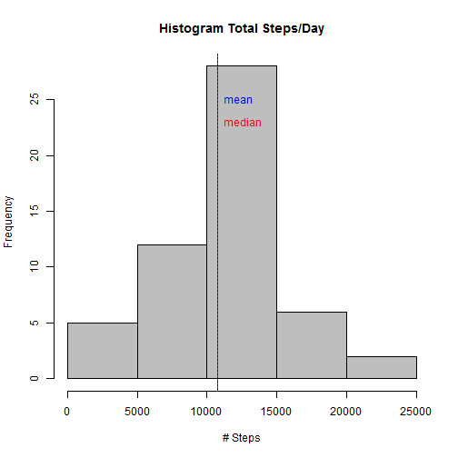
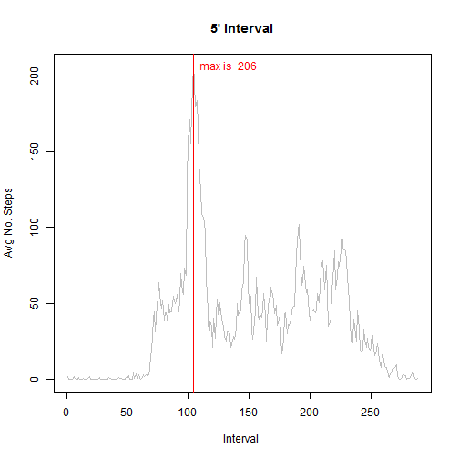
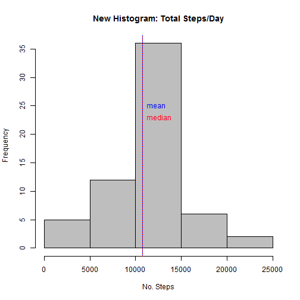
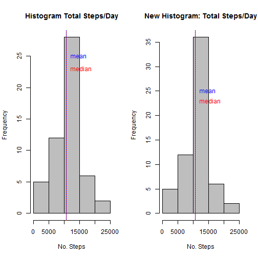
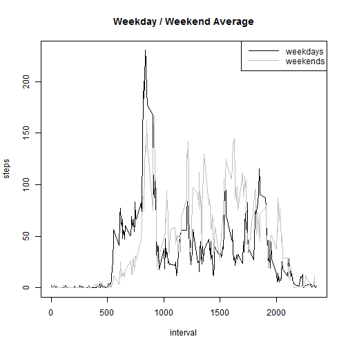

# Reproducible Research: Peer Assessment 1

Reading data


```r
data <- read.csv(unz("activity.zip", "activity.csv"))
```


## Loading and preprocessing the data

Preprocessing and cleaning steps


```r
cases <- complete.cases(data)
missingCases <- length(cases[cases==F])
completeCases <- length(cases[cases==T])
```

Ignore the incomplete cases on the dataset

```r
completes <- subset(data,complete.cases(data)==T)   # Subset of the complete cases
```


## What is mean total number of steps taken per day?

Histogram of the total number of steps taken each day


```r
stepsByDay <- split(completes, completes$date, drop=T)                  # divide the complete cases by day
dailySteps <- sapply(stepsByDay, function(x) sum(x$steps))              # vector with the sum of the steps by day
hist(dailySteps, main="Histogram Total Steps/Day", xlab="# Steps", col="gray") # draw the histogram
abline(v=mean(dailySteps), lty=1, col="blue")                           # draw the mean line
abline(v=median(dailySteps), lty=3, col="red")                          # draw the median line
text(mean(dailySteps),25,labels="mean", pos=4, col="blue")              # draw the mean label
text(mean(dailySteps),23,labels="median", pos=4, col="red")             # draw the median label
```

 

with the mean and median total number of steps taken per day


```r
summary(dailySteps)                                 # print the dailySteps summary
```

```
##    Min. 1st Qu.  Median    Mean 3rd Qu.    Max. 
##      41    8841   10760   10770   13290   21190
```


## What is the average daily activity pattern?

Average activity pattern


```r
intervalSplit <- split(completes,completes$interval, drop=TRUE)         # split the complete cases by interval
intervalAverage <- sapply(intervalSplit, function(x) mean(x$steps))     # vector with the average of steps by day
plot(intervalAverage, type="l",  main="5' Interval", ylab="Avg No. Steps", xlab="Interval ", col="gray") # draw the plot with the 5' series
abline(v=which.max(intervalAverage), lty=1, col="red")                  # draw the median line
text(which.max(intervalAverage),max(intervalAverage), 
     labels=paste("max is ",as.character(round(max(intervalAverage)))), 
     pos=4, col="red")                                                  # draw the label
```

 

The 5-minute interval that contains the maximum number of steps on average across all the days in the dataset is the interval with the name 835.


```r
names(which.max(intervalAverage)) 
```

```
## [1] "835"
```

With an average of 206 number of steps.


```r
round(max(intervalAverage))
```

```
## [1] 206
```

And located in the position number 104 at interval.


```r
which.max(intervalAverage)
```

```
## 835 
## 104
```


## Imputing missing values

The total number of missing cases is 2304.


```r
missingCases
```

```
## [1] 2304
```

Filling the NA values with the rounded value of the interval average


```r
dataCases <- cbind(data,cases)                          # dataCases, adding 'cases' column  
splitCases<-split(dataCases,dataCases$cases, drop=TRUE)  # split by cases 

for (row in 1:nrow(splitCases[["FALSE"]])){  # substitute each NA by the rounded value of the intervalAverage
    splitCases[["FALSE"]][row,1] <- round(subset(intervalAverage,names(intervalAverage) ==
                                     as.character(splitCases[["FALSE"]][row,3])))
}

dataCases <- rbind(splitCases[["FALSE"]],splitCases[["TRUE"]])           # combine the cases
dataCases <- dataCases[with(dataCases, order(date, interval)), ]         # ordering by date and interval
```

Histogram of the total number of steps taken each day


```r
splitNewByDay <- split(dataCases,dataCases$date, drop=TRUE)                  # split the dataCases by date  
dailyStepsNew <- sapply(splitNewByDay, function(x) sum(x$steps))         # vector with the sum of the steps by day
hist(dailyStepsNew, main="New Histogram: Total Steps/Day", xlab="No. Steps", col="gray") # draw the histogram
abline(v=mean(dailySteps), lty=1, col="blue")                      # draw the mean line
abline(v=median(dailySteps), lty=3, col="red")                     # draw the median line
text(mean(dailySteps),25,labels="mean", pos=4, col="blue")         # draw the mean label
text(mean(dailySteps),23,labels="median", pos=4, col="red")        # draw the median label
```

 

Comparing summary data (mean and median)

Summary of data without NA

```r
summary(dailySteps) 
```

```
##    Min. 1st Qu.  Median    Mean 3rd Qu.    Max. 
##      41    8841   10760   10770   13290   21190
```

Summary of data with the substituted value

```r
summary(dailyStepsNew) 
```

```
##    Min. 1st Qu.  Median    Mean 3rd Qu.    Max. 
##      41    9819   10760   10770   12810   21190
```

Comparing the histogram without NA and with the substituted value, there is not a big difference, only the central bar is bigger.

```r
par(mfrow=c(1,2))

# histogram without NA
hist(dailySteps, main="Histogram Total Steps/Day", xlab="No. Steps", col="gray") # draw the histogram
abline(v=mean(dailySteps), lty=1, col="blue")                           # draw the mean line
abline(v=median(dailySteps), lty=3, col="red")                          # draw the median line
text(mean(dailySteps),25,labels="mean", pos=4, col="blue")              # draw the mean label
text(mean(dailySteps),23,labels="median", pos=4, col="red")             # draw the median label


# histogram with value in substitution of NA
hist(dailyStepsNew, main="New Histogram: Total Steps/Day", xlab="No. Steps", col="gray") # draw the histogram
abline(v=mean(dailySteps), lty=1, col="blue")                      # draw the mean line
abline(v=median(dailySteps), lty=3, col="red")                     # draw the median line
text(mean(dailySteps),25,labels="mean", pos=4, col="blue")         # draw the mean label
text(mean(dailySteps),23,labels="median", pos=4, col="red")        # draw the median label
```

 


## Are there differences in activity patterns between weekdays and weekends?

Differences between weekdays and weekends

```r
dataCases$date <- as.Date(strptime(dataCases$date, format="%Y-%m-%d")) # convert date column to date class  
Sys.setlocale("LC_TIME", "English")                                    # set language as english
```

```
## [1] "English_United States.1252"
```

```r
dataCases$day <- weekdays(dataCases$date)                              # Factor to differentiate weekdays and weekends

# for saturday or sunday day is weekend otherwise day is weekday
for (i in 1:nrow(dataCases)) {                                       
    if (dataCases[i,]$day %in% c("Saturday","Sunday")) {             
        dataCases[i,]$day<-"weekend"                                 
    }
    else{
        dataCases[i,]$day<-"weekday"                                 
    }
}

# aggregate steps by day as a function of interval plus day  
stepsByDay <- aggregate(dataCases$steps ~ dataCases$interval + dataCases$day, dataCases, mean)

# add the column names
names(stepsByDay) <- c("interval", "day", "steps")

# plot weekday over weekend time series
par(mfrow=c(1,1))  
with(stepsByDay, plot(steps ~ interval, type="n", main="Weekday / Weekend Average"))  
with(stepsByDay[stepsByDay$day == "weekday",], lines(steps ~ interval, type="l", col="black"))  
with(stepsByDay[stepsByDay$day == "weekend",], lines(steps ~ interval, type="l", col="gray" ))  
legend("topright", lty=c(1,1), col = c("black", "gray"), legend = c("weekdays", "weekends"), seg.len=4)
```

 

